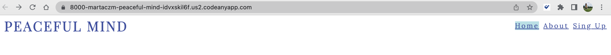

# *Peaceful Mind*

### How it stated
Peaceful Mind is a site that had been created with the idea in mind of normalising mental health awareness, also most of the UK's residents are in need of a community where they can express their thoughts, find answers and have a place where they can look for similar stories. This site will be targeted toward any person looking for a community that can understand them and they should feel free to ask questions and get answers. Peaceful Mind will provide its users with important information such as the places and dates where the Peaceful Mind community will host meetings and site users can take part in the events.

## Features

 - **Responsive Desing:** The Navigation Bar has a responsive design that allows it to adjust to various screen sizes and deliver a consistent user experience on PCs, tablets, and mobile devices.
 - **Clear Navigation:** Users may locate and access the Home, About us and Sign Up sections of the website easily due to the Navigation Bar's logical and intuitive organisation of the links.
 - **Accessibility:** The Navigation Bar was created with accessibility in mind, and it complies with web standards and best practises, including correct labelling, keyboard navigation support, and semantic markup, to make sure it is useful for persons with impairments.

- **The landing page image:**
    * The website landing is including an image with a text overlay that is presenting the organisation main goal and where is all situated. 
    * This section is presenting to the user a first glance of what the supporting groups look like and the special bond people create within the organisation.