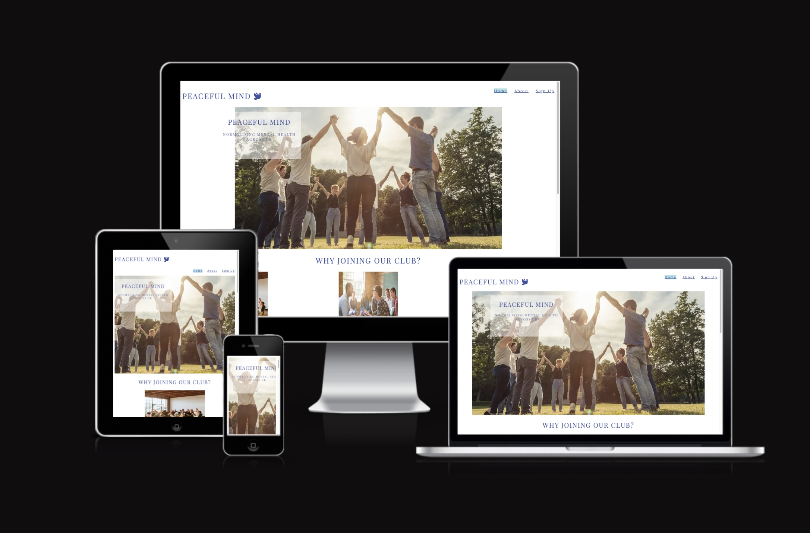
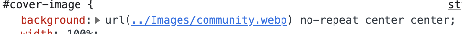
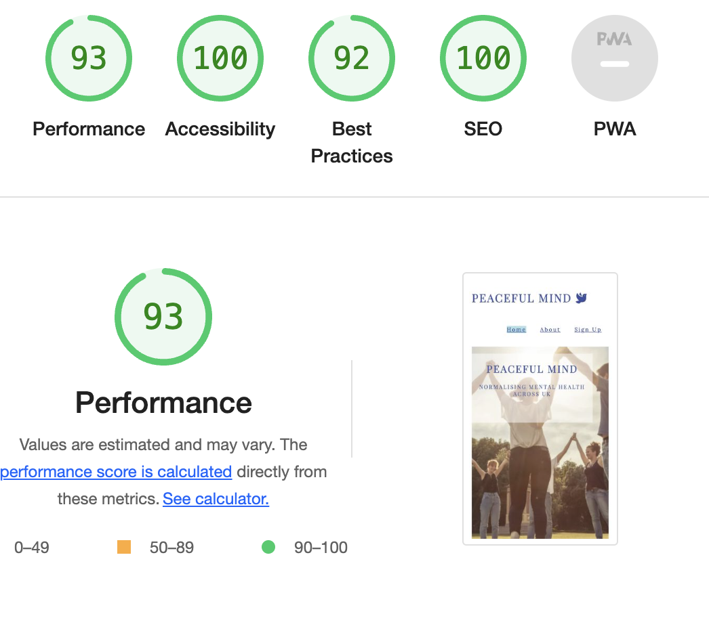
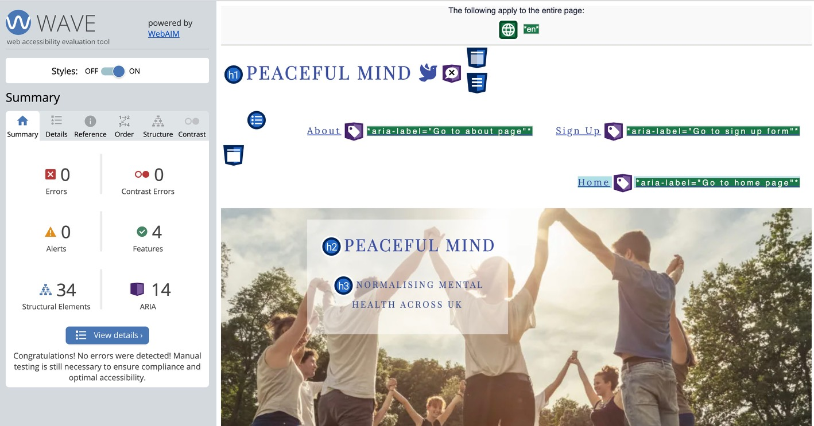

# *Peaceful Mind*

## How it stated
Peaceful Mind is a website that had been created with the idea in mind of normalising mental health awareness aroun UK, also most of the UK's residents are in need of a community where they can express their thoughts, find answers and have a place where they can look for similar stories. This site will be targeted toward any person looking for a community that can understand them and they should feel free to ask questions and get answers. Peaceful Mind will provide its users with important information such as the places and dates where the Peaceful Mind community will host group meetings and website users can take part in the events. The users can use the website to discover more about the community and subscribe to the weekly newsletter.

## Features

- **Navigation Bar**

    * Responsive Desing: The Navigation Bar has a responsive design that allows it to adjust to various screen sizes and deliver a consistent user experience on PCs, tablets, and mobile devices.

    * Clear Navigation: Users may locate and access the Home, About us and Sign Up sections of the website easily due to the Navigation Bar's logical and intuitive organisation of the links.

    * Accessibility: The Navigation Bar was created with accessibility in mind, and it complies with web standards and best practises, including correct labelling, keyboard navigation support, and semantic markup, to make sure it is useful for persons with impairments.

- **The website landing image:**

    * The website landing is including an image with a text overlay that is presenting the organisation main goal and where is all situated. 

    * This section is presenting to the user a first glance of what the supporting groups look like and the special bond people create within the organisation.

    * This section will also apear on the About page.

- **The Club Golas Section**

    * The club goals section is design to provide information to the reader related to what is like to be part of our community.

    * The information provided to the users is showing the benefits of taking part in our comunity and how will help in improving their mental health.

- **Group Meeting Section**

    * The group meeting section is design to provide to the users information such as where our group meetings will take place, location and time.

    * This section will update monthly, considering that the locations and time could change.

- **The Footer**

    * Within the footer user can find direct links to the social media paltforms for the Peaceful Mind. The links will sent the user on a new tab to the related social media platform.

    * The footer gives the user the accesibility to keep on touch with the community via social media.

- **About Page**

    * The about page will provide extra information to the user regarding our club structure, picture with different people taking part in our club and the activities we plan.

    * This section is important for our users as they will get familier and have a closer view of the club, they will undestand how we work and what we plan to fulfil.
 

- **The Sign Up Page**

    * This page is designed to offer to our users the possibility to join our community, being able to specify which location is mainly accesible for them, for example; London, Manchester or Edinburgh. 

    * Using this feature the users will receive information related to the events that take place in their location on the weekly newsletters that they subscribed to.

- **Future features to implement**

    * For the future the website will include Q&A page where users can ask quetsions and receive answers from the rest of the community.

## Testing
- 
    * I have tested the compatibility of the web page on different browsers such as Safari, Chrome, Firefox.

    * Using the developer tools, Chrome extension, I verified that this project is responsive, looks satisfactory, and works on all common screen sizes.

    * I verified that all of the navigation, header, about, and sign up are clear and readable.

    * The sign-up form is functional, given that it requires information in every area, only accepts email addresses in the email field, and the submit button functions.

## Bugs
- Solved bugs
    * The landing page was not loading the picture when I deployed my project to GitHub Pages because the backdrop image's code was broken.

    * I discovered this was because I used the code path with a uppercase letter for the image folder such as
    

- Unfixed bugs
No unfixed bugs

## Validator Testing

- HTML
    * When running through the official W3C validator, there were no problems returned.
- CSS
    *  When running through the official (Jigsaw)validator, there were no problems returned.
- Accessibility 
    * I confirmed that the colors and fonts chosen are easy to read and accessible by running it through Wave Evaluation Tool Chrome extension and lighthouse devtools.
    
    

## Deployment
- The website was deployed to GitHub pages.The following are the deployment steps:
    * In the GitHub repository, navigate to the Settings tab
    * From the left menu select the Pages tab
    * From the source section drop-down menu, select the main branch
    * Once the main branch selection is saved, the page provided the link to the completed website.

The live link can be found here: [Peaceful Mind](https://martaczm.github.io/peaceful-mind/)

## Credits

### Content
-  The code for the navigation bar menu and social media links was taken from the CI [Love Running](https://github.com/Code-Institute-Solutions/love-running-2.0-sourcecode.git) Project

